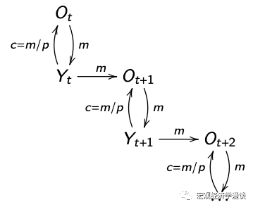

# 人们为何使用货币？

导读：在上一章中，我们发现货币在经典理论中是没有价值的。为什么人们在现实中使用货币呢？

货币有三个作用：
计价单位(unit of account)
储值工具(store of value)
交易媒介(medium of exchange)
前两个功能其他的资产也可以实现，唯独第三个功能是货币特有的性质，这也是人们在现实中使用货币的一个重要原因。

01 
搜寻匹配

经典的资产定价以及宏观经济学模型中假设交易永远可以无摩擦地进行。特别地，每个人手中的商品都可以与其他任何人手中的商品交易。然而，现实中交易双方并不总是恰好能提供对方想要的东西的。例如，教师给学生讲一上午的课，作为回报，教师想要下课后吃一顿好吃的。但是学生不会做饭，怎么办？这个时候货币就派上用场了。学生只需要把货币交给老师，老师把货币交给厨师，然后老师就能得到一顿大餐。厨师为什么愿意为了一张纸片忙活半天呢？因为厨师相信将来他把这张纸片给下一个商家的时候，可以换回自己想要的东西。

这个例子体现了一个经典的经济学问题：double coincidence of wants，即交易双方都恰好想要对方能够提供的商品或服务。现实中这种情况很罕见。为了使交易能够顺利进行，人们发明了货币。在这个例子中，货币发挥了交易媒介(medium of exchange)的作用。

02 
社会保险

思考一个问题：老年人和年轻人如何交易？老年人无法生产，只能消费年轻人生产的商品。但是年轻人凭什么给老年人打工呢？在经典理论中，老年人只能通过债务交换年轻人生产的商品，但是老年人没有办法偿还债务，所以老年人无法和年轻人交易。

当存在货币时，这个问题就可以解决了。老年人把货币交给年轻人，年轻人愿意为此给老年人提供商品与服务。为什么呢？因为年轻人相信等到他们老了，可以把货币交给未来的年轻人，让他们给老年的自己打工。只要这样的信念保持下去，世代之间就永远可以进行交易。

在这个例子中，年轻人和老年人之间的交易出现了摩擦。货币再次充当交易媒介，使得世代之间可以交易。此例中货币的这个功能和社保类似。

03 
货币中性

在有交易摩擦的世界中，货币有了价值。那么货币的数量会影响人们的交易吗？古典的观点认为，货币数量只会影响名义价格（CPI），而不会影响任何实际变量（失业率、消费、实际GDP等）。这个理论被称为“货币中性”。

为什么货币是中性的呢？因为如果人们手里的钱变多了，物价等比例升高，恰好可以消除多出来的钱，最终每个人能买到的东西跟原来一样多。

如果货币真的是中性的，那么货币政策就完全失去了意义，各国的央行也可以撤销了。为什么现实中增加货币供给可以减小失业率、提振实际产出呢？我们后面再讲。
# 总结
在这一章中，我们探讨了现实中人们使用货币的关键原因。在下一章中，我们将要探讨货币的供给与需求。